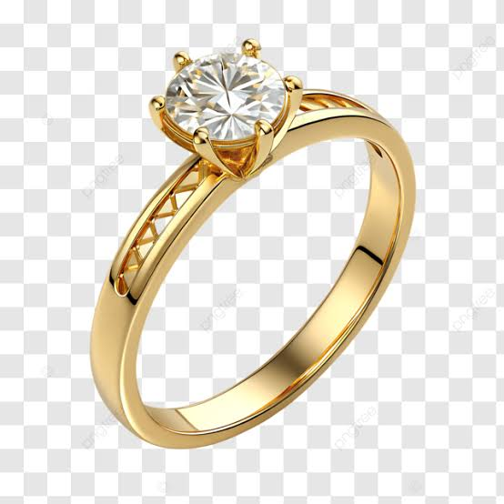
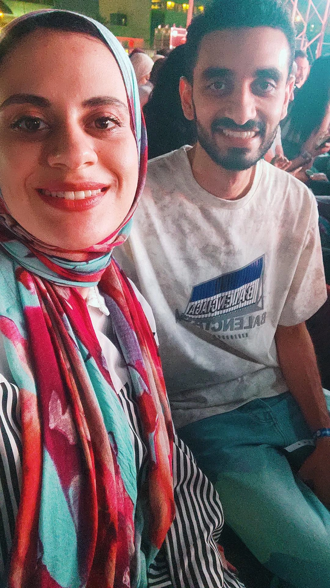

<!DOCTYPE html>
<html lang="en">
<head>
<meta charset="UTF-8">
<meta name="viewport" content="width=device-width, initial-scale=1.0">
<title>For Ayaa ❤️</title>

</head>

<body>

<audio id="bgMusic" autoplay loop>
    <source src="music.mp3" type="audio/mpeg">
</audio>

    

    <h1>Will You Be My Valentine? 💖</h1>
    
3

    <button id="yes" onclick="sayYes()">Yes 💍</button>
    <button id="no" onmouseover="moveNo()">No 😢</button>

    
    

</body>
</html>
